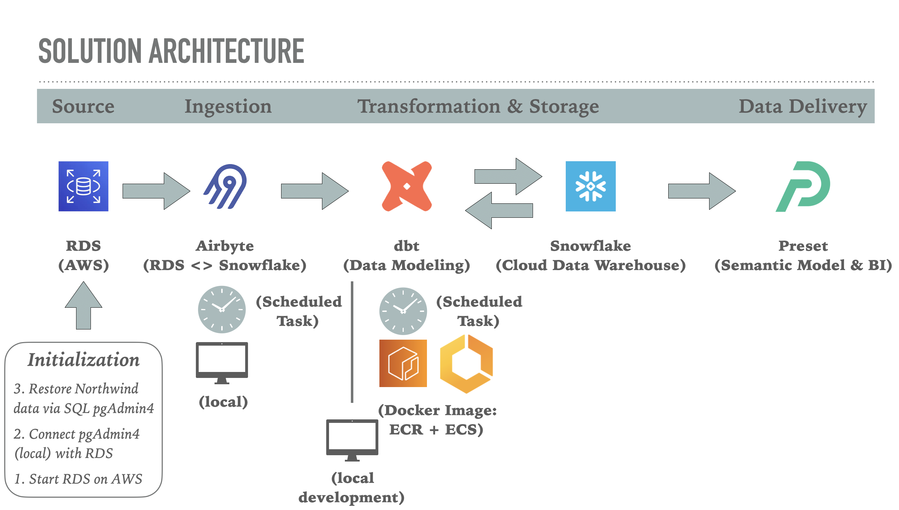
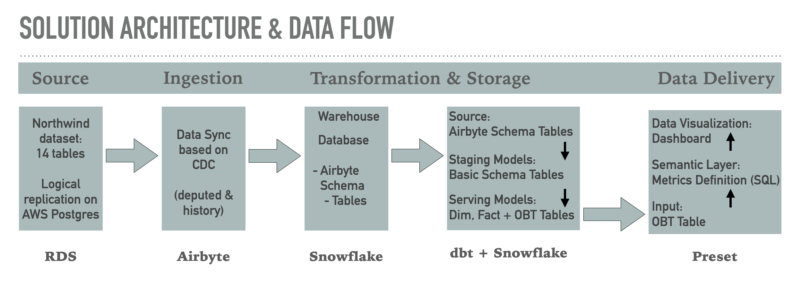
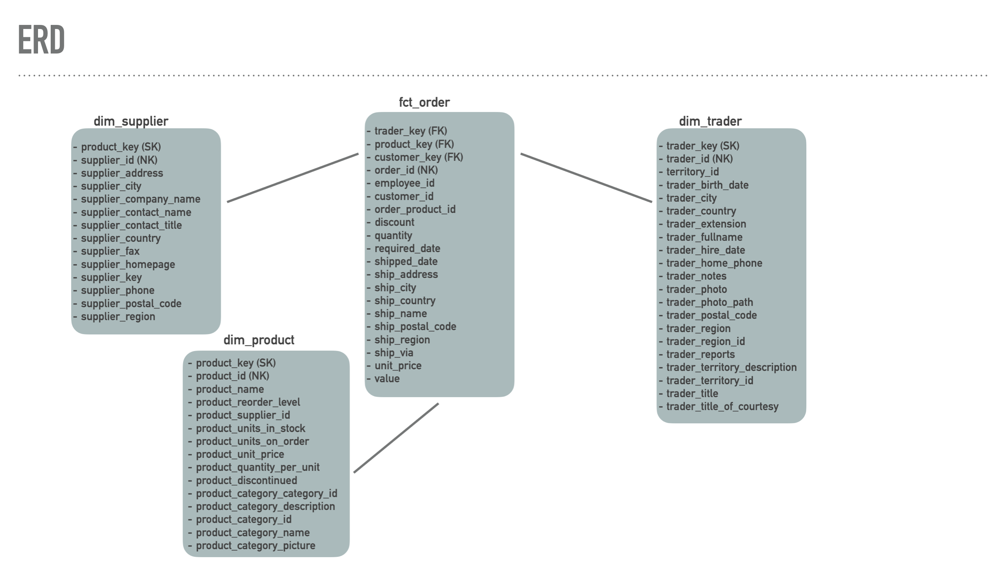
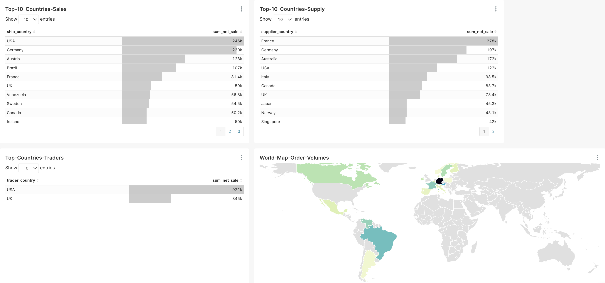

## Introduction

The current project represents a showcase of a high-performance data pipeline established within a cloud-based environment. This project was developed during the particpation of the data engineering class of [**DEC**](https://dataengineercamp.com/) using the classic ["Northwind"](https://github.com/pthom/northwind_psql) database. The project's challenge was to build a multi-level EXTRACT-LOAD-TRANSFORM (ELT) data pipeline that would eventually allow convenient data access to a hypothetical business analyst (i.e., consuming data within a given BI-tool such as Preset, Power-BI, Tableau etc). The dataset and business questions are both of exemplary nature, while all data engineering techniques used were designed to represent best-in-class methodologies.

## Objective  
The goal of the data pipline is to provide records of business transactions to BI analysts so that they can answer three main business questions and additionally can slice- and dice using a range of different attributes within a BI-tool:
+ What are the top 10 countries generating the highest sales?
+ What are the top 10 countries supplying the products for these sales?
+ What are the top 10 countries that enable these trades?

## Consumers 
The intented consumers are BI analysts that will consume the data via a given BI tool. In the current project the data will be dilvered to be used inside the Open Source BI Platform [**Preset**](https://preset.io/). In fact, the final outcome of the dimensional modeling will be a fact table and several dimensional tables characterizing the business event of "placing an order". In addition, we will have a single table housing all data in a single large table in the fashion of OTB (one big table).

## Source dataset
The database used in this project represents a classic database that was originally created by Microsoft containing sales data of a fictitious company called “Northwind Traders”: https://github.com/pthom/northwind_psql

## Solution architecture
The following graphical overview shows all components or services that were combined to implement the current solution. All components were deployed in the cloud (execept for Airbyte). 

## Dataflow: from source to BI-tool
The graphical schema represents the dataflow between and within components of the designed solution architecture.

## Dimensional modeling (fact and dimensional tables)
The outcome of the dimensional modeling is summarized by the Entity Relationship Diagram (ERD) shown below (FK = Foreign Key, SK = Surrogate Key, NK = Natural Key).

## Example Dashboard (based on semantic layer): Preset

 

## Current Code Repository
The code elements shared within this repository reflect the data transformation and modeling part of the pipline that was realized within dbt connected to Snowflake serving as data warehouse.